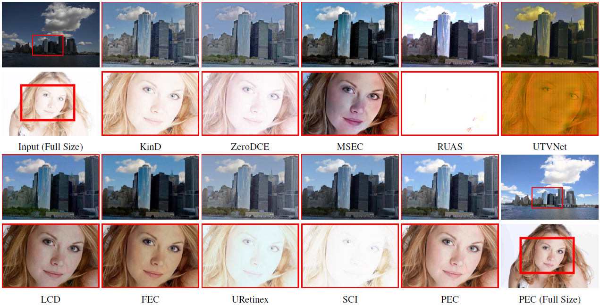
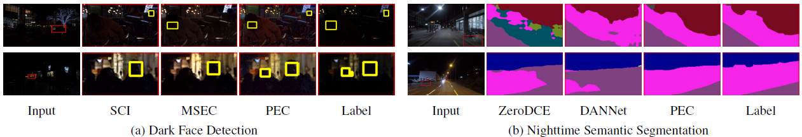

# Practical Exposure Correction: Great Truths Are Always Simple
 

[[Paper](1https://openaccess.thecvf.com/content/CVPR2022/html/Ma_Toward_Fast_Flexible_and_Robust_Low-Light_Image_Enhancement_CVPR_2022_paper.html)] 

 

Practicability evaluation. In (a), we compare nine advanced deep networks and nine traditional methods (please refer to the
experimental part for detailed sources) by using different computational resources. In (b), we demonstrate a group of visual comparisons
among two deep networks and PEC on the same scene [3] but with different exposure conditions (the left top and right bottom are
overexposure and underexposure, respectively). In (c), we show visual comparisons among two traditional methods and PEC on different
scenes [9, 24] with different degrees of underexposure. Obviously, our PEC realizes the best visual effects and spends least running time
simultaneously, which fully indicates the practicability of PEC.

## Codes
### Requirements for Python
* python3.7
* pytorch==1.8.0
* cuda11.1

### Testing
* Please note that we have provided parameter examples for both overexposure correction and low exposure correction in different versions of the code for your reference
#### Python
* Prepare the data and put it in './Input/under' or './Input/over'
* Set the parameters in *PEC.py* according to your data
* Run *PEC.py*
#### Matlab
* Prepare the data and put it in './Input/under' or './Input/over'
* Set the parameters in *PEC.m* according to your data
* Run *PEC.m*
* #### C++
* Coming soon...

## Results on Exposure Correction
 

## Results on High-level Vision Tasks
### Dark Face Detection and Nighttime Semantic Segmentation
 

